# HELIOS

**HELIOS is an AI-powered personal operating system for goals, tasks, calendars, memory, connected services, and daily decision support.**

HELIOS is not another productivity app. It is designed as a life operating system: a unified platform that understands user context, tracks long-running priorities, reasons across calendar and task data, and turns personal information into actionable guidance.

The project is a full-stack mobile platform built with a React Native / Expo iOS client, a FastAPI backend, PostgreSQL persistence, JWT authentication, encrypted OAuth token storage, semantic memory, daily history, task intelligence, relationship logic, and AI provider orchestration.

---

## Product Preview

Sanitized V3 screenshots are included in the repository so the product can be evaluated without exposing personal account data. The screenshots use a dummy account (`Alex Demo`) and include both dark and light mode captures.

### Dark Mode

<table>
  <tr>
    <th>Home</th>
    <th>Assistant</th>
    <th>Goals</th>
  </tr>
  <tr>
    <td>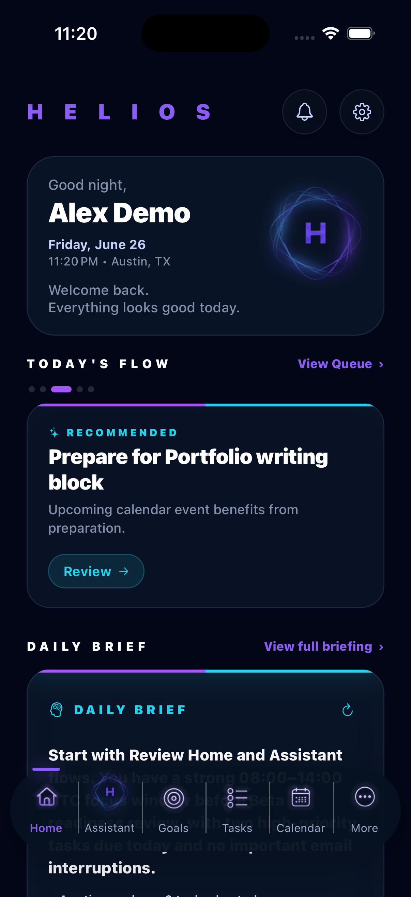</td>
    <td>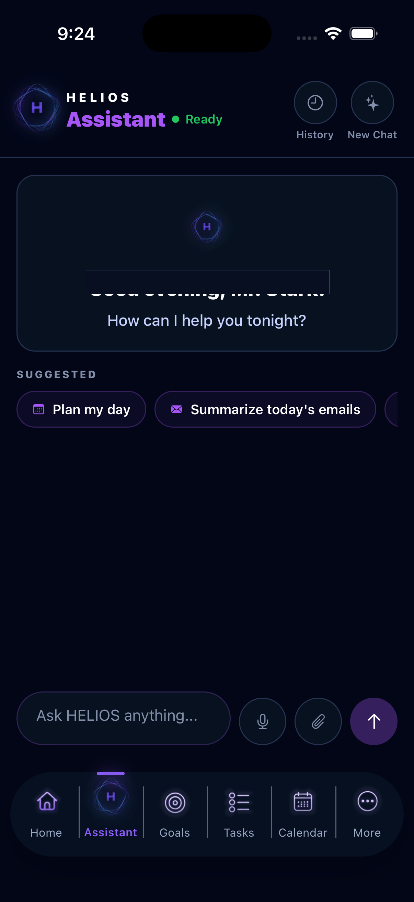</td>
    <td>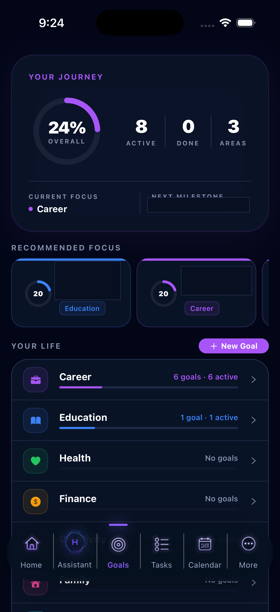</td>
  </tr>
  <tr>
    <th>Tasks</th>
    <th>Calendar</th>
    <th>More</th>
  </tr>
  <tr>
    <td>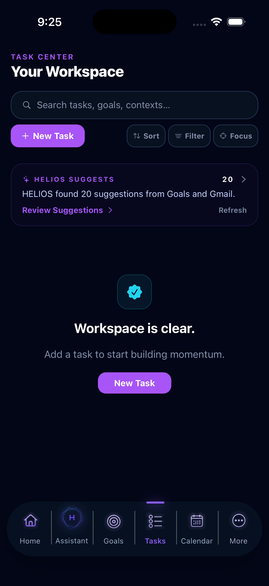</td>
    <td>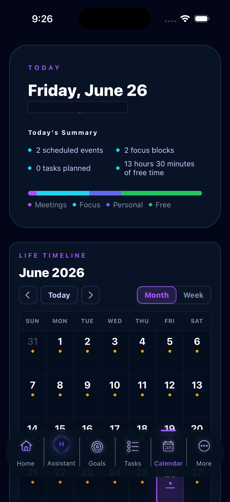</td>
    <td>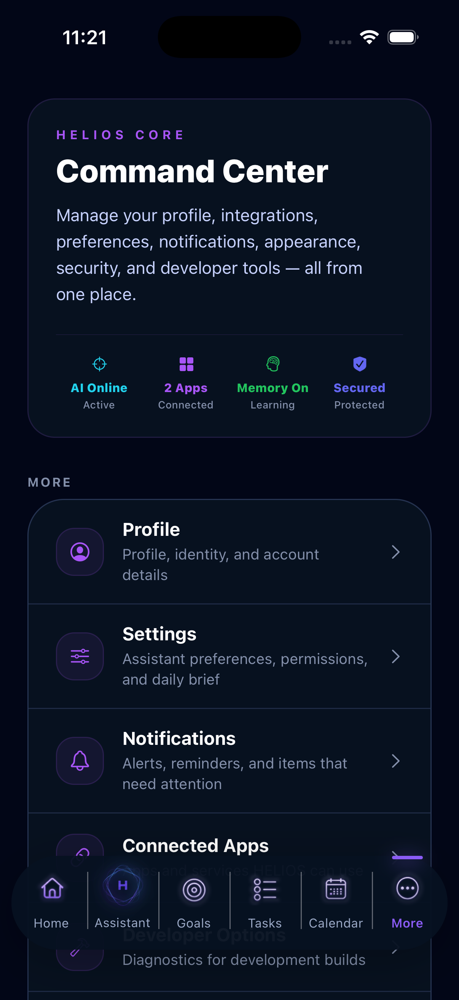</td>
  </tr>
  <tr>
    <th>Connected Services</th>
    <th>Profile</th>
    <th>Settings</th>
  </tr>
  <tr>
    <td>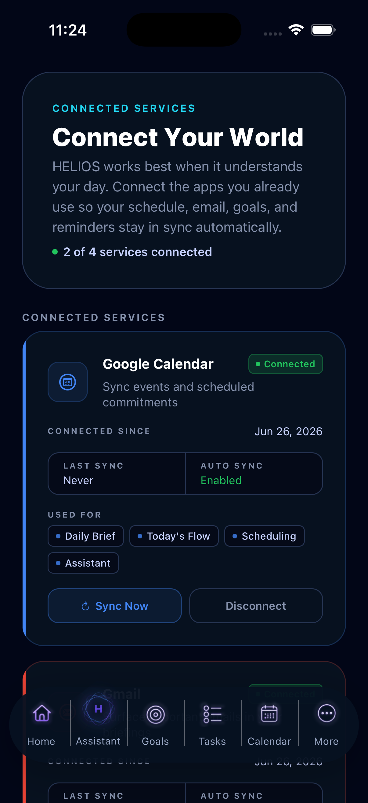</td>
    <td>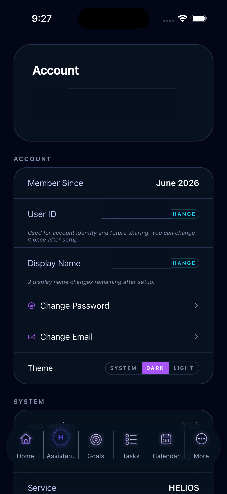</td>
    <td>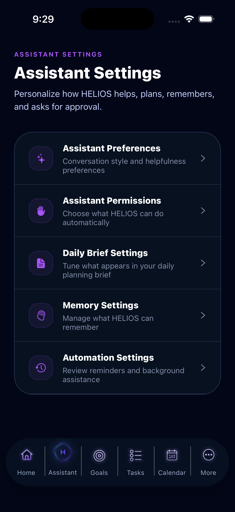</td>
  </tr>
  <tr>
    <th colspan="3">Notifications</th>
  </tr>
  <tr>
    <td colspan="3" align="center">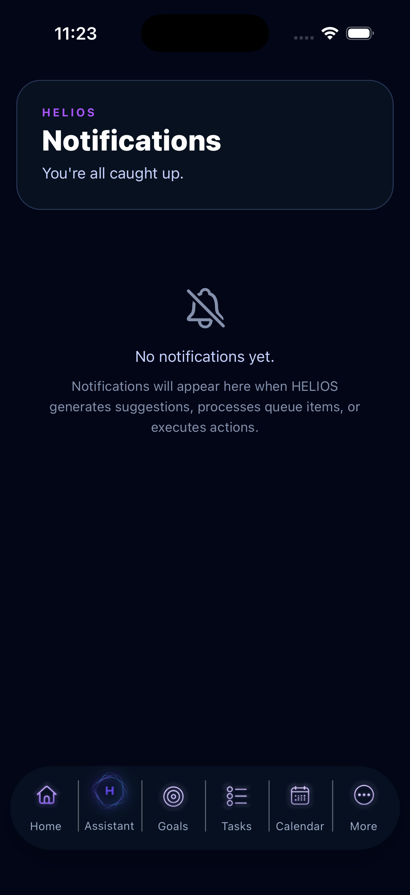</td>
  </tr>
</table>

### Light Mode

<table>
  <tr>
    <th>Home</th>
    <th>Assistant</th>
    <th>Goals</th>
  </tr>
  <tr>
    <td>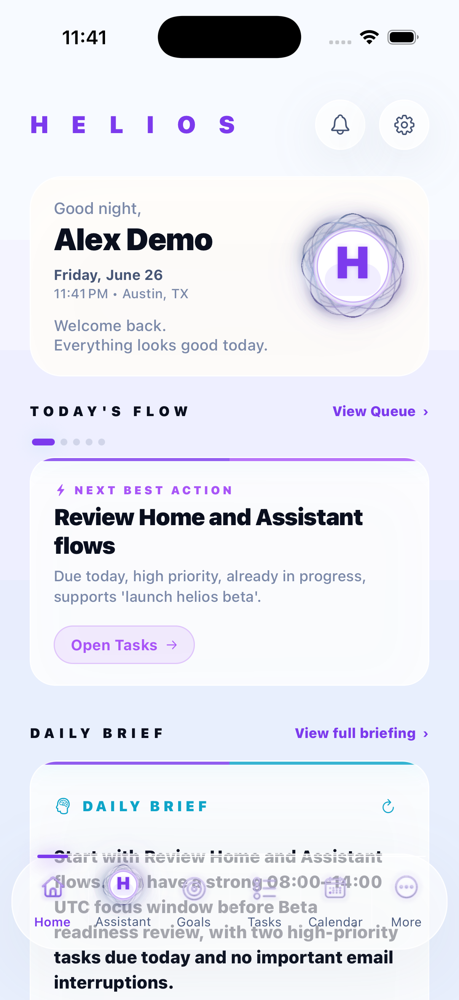</td>
    <td>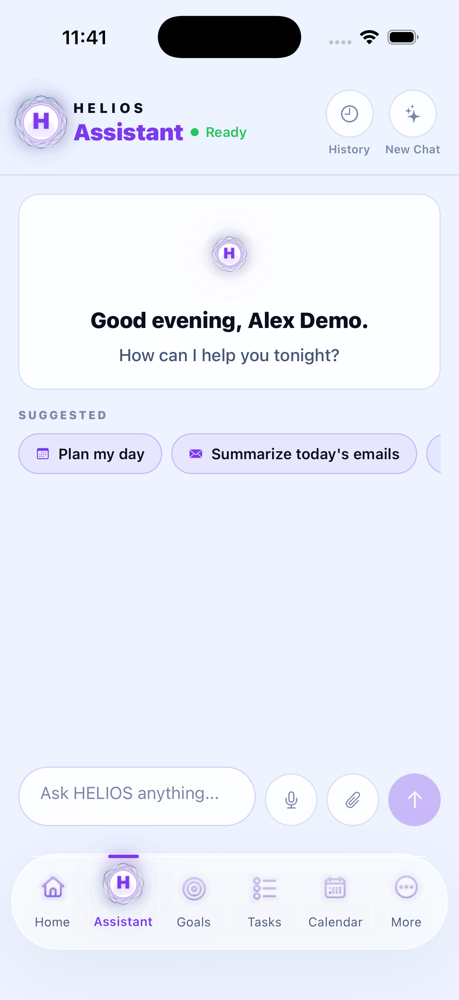</td>
    <td>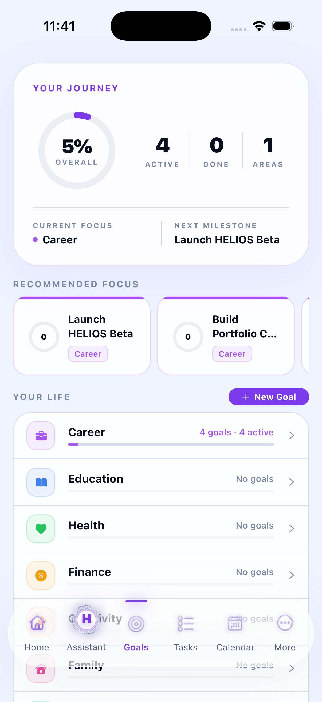</td>
  </tr>
  <tr>
    <th>Tasks</th>
    <th>Calendar</th>
    <th>More</th>
  </tr>
  <tr>
    <td>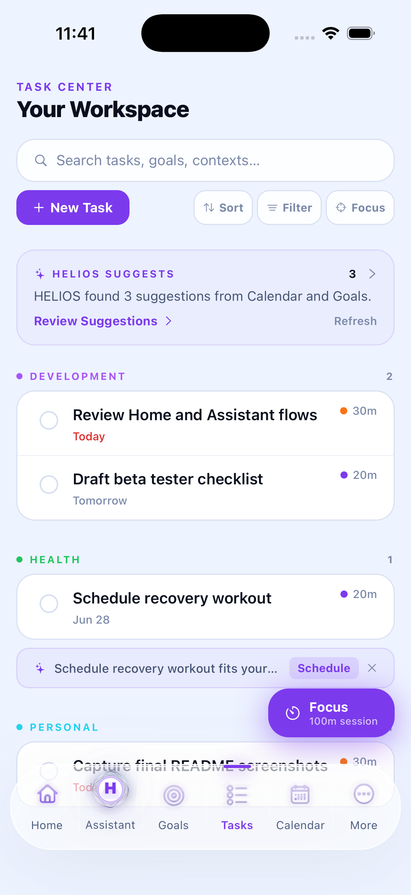</td>
    <td>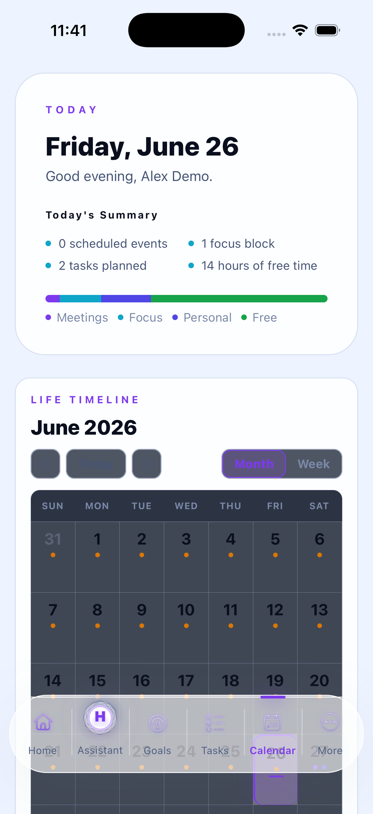</td>
    <td>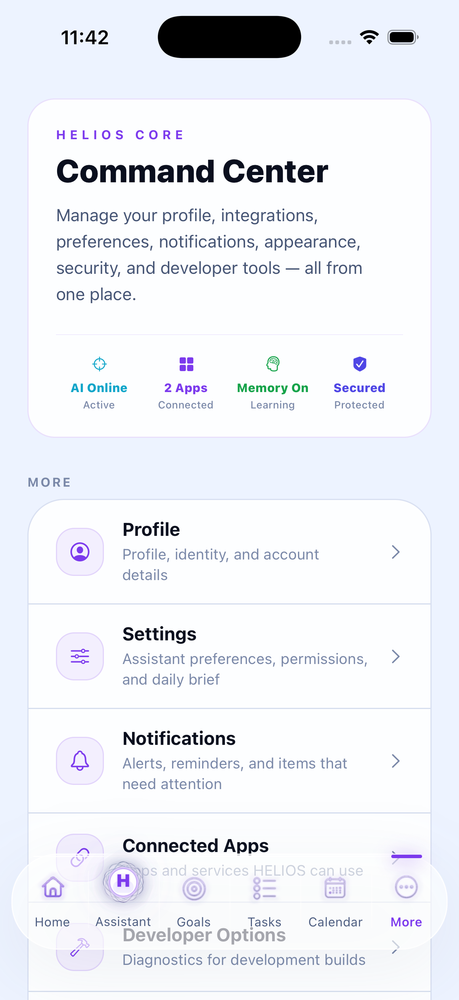</td>
  </tr>
  <tr>
    <th>Connected Services</th>
    <th>Profile</th>
    <th>Settings</th>
  </tr>
  <tr>
    <td>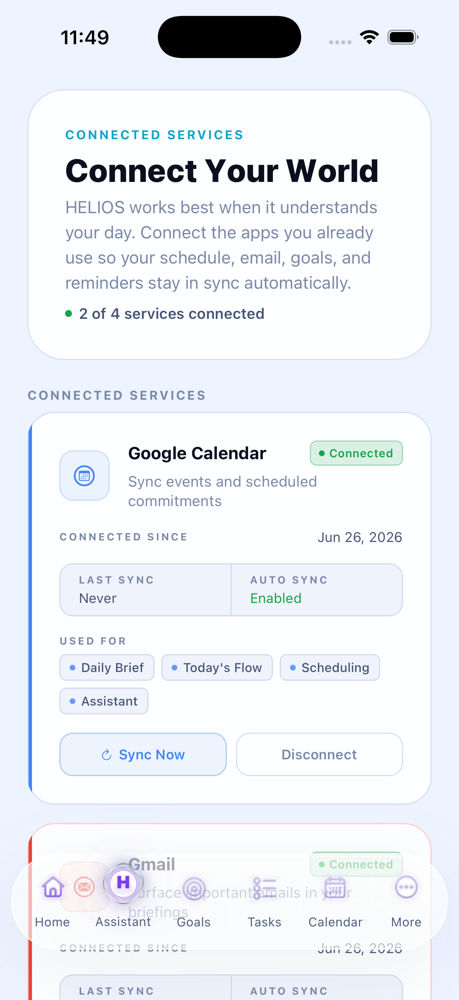</td>
    <td>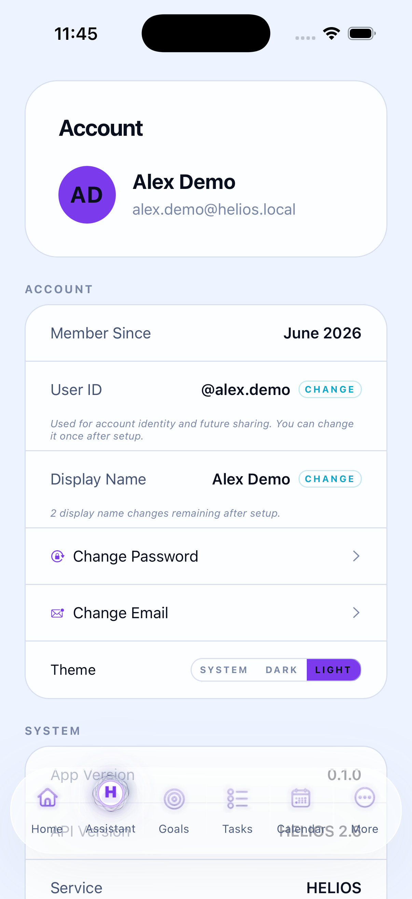</td>
    <td>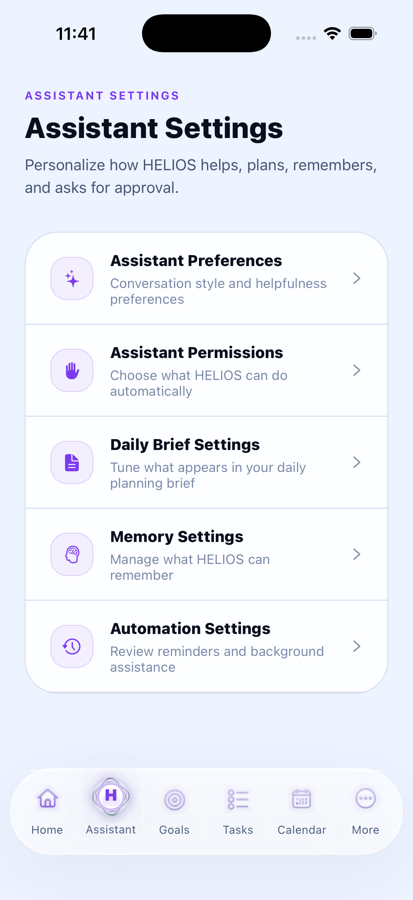</td>
  </tr>
  <tr>
    <th colspan="3">Notifications</th>
  </tr>
  <tr>
    <td colspan="3" align="center">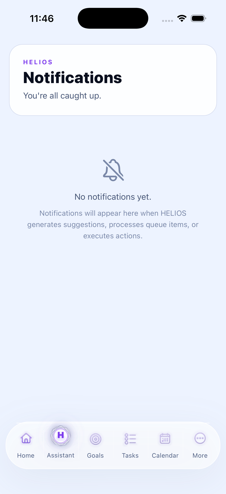</td>
  </tr>
</table>

---

## Current Capabilities

- AI-powered Daily Briefs and contextual assistant chat
- Home recommendations and next-best-action intelligence
- Goal tracking with progress, linked tasks, and relationship health
- Task creation, completion, scheduling, and HELIOS-generated suggestions
- Calendar timeline, day details, available windows, and history
- Google Calendar and Gmail integration architecture with encrypted token storage
- Semantic memory and retrieval foundation for user-scoped context
- Profile, theme, display-name, User ID, email, password, and notification settings
- Secure authentication with JWT, bcrypt password hashing, and protected backend routes
- Dockerized FastAPI backend with PostgreSQL, Alembic migrations, pytest coverage, and mobile TypeScript/Jest validation

---

## V3 Private Beta Status

**Current stage:** V3 polish and private beta readiness.

The `helios-v3` branch is the current stabilized development branch. It has passed backend pytest, Alembic migration verification, backend compile checks, mobile TypeScript checks, ESLint, and Jest. Remaining release gates before a public beta snapshot are real-device QA, live Google OAuth verification, merging `helios-v3` into `main`, and tagging a beta release.

Helpful readiness docs:

- [Private Beta Readiness Checklist](docs/private-beta-readiness-checklist.md)
- [Release Checklist](docs/release-checklist.md)
- [Portfolio Materials](docs/PORTFOLIO_MATERIALS.md)
- [Known Limitations](docs/final-known-limitations.md)
- [Screenshot Guide](docs/screenshot-guide.md)

---

## Project Overview

HELIOS exists to solve a common problem in personal productivity software: important context is scattered across apps, and users are left to manually translate goals, schedules, emails, tasks, and reminders into daily action.

The platform organizes that context into a single user-scoped intelligence layer. HELIOS can summarize the day, surface next best actions, track goal progress, generate task suggestions, retain useful memory, and connect external services such as Google Calendar and Gmail.

The long-term vision is a personal operating system that becomes more useful as it learns the user's patterns, priorities, calendar constraints, and goals. The current codebase focuses on private beta readiness: reliable authentication, core data models, mobile workflows, backend contracts, AI context retrieval, and secure integration infrastructure.

Target users include:

- Individuals managing complex personal, academic, or professional goals
- Builders and operators who need a unified command center for execution
- Users who want AI assistance grounded in their actual schedule, tasks, history, and memory
- Technical reviewers evaluating mobile architecture, backend design, AI systems, and full-stack product engineering

---

## Current Status

**Current stage:** Private Beta Development

Implemented:

- Mobile iOS app with tab-based navigation and authenticated user flows
- FastAPI backend with PostgreSQL, Alembic migrations, and Docker support
- JWT authentication, refresh sessions, profile management, User ID, and display-name controls
- Goals, tasks, calendar events, reminders, notifications, daily history, and settings
- AI assistant, daily brief engine, agent orchestration, assistant context preview, semantic memory, and task suggestions
- Google Calendar and Gmail integration architecture, including OAuth flow support, encrypted token storage, sync endpoints, and mock/simulated development paths
- Relationship logic for next best actions, goal progress, available windows, and task-goal-calendar coordination
- Autonomy queue, rules, audit log, background jobs, and notifications infrastructure
- Backend tests and mobile type/lint tooling

In active development:

- Private beta polish and QA
- Real-world integration hardening
- Expanded test coverage around mobile flows and AI/context systems
- Production deployment and monitoring readiness

---

## Core Capabilities

### AI Intelligence

HELIOS includes an AI provider manager with fallback support, assistant chat, agent orchestration, context building, semantic memory, daily briefs, and task/action recommendations. AI responses are intended to be grounded in user-scoped application data rather than generic prompts.

### Daily Brief

The Daily Brief system generates a structured summary of the user's day using goals, tasks, calendar data, reminders, history, and assistant context. Briefs can be fetched for today, generated on demand, and retrieved by date.

### Assistant

The Assistant screen provides conversational help with contextual awareness. It connects to persisted conversations, assistant context retrieval, recommended actions, follow-up questions, and AI status handling.

### Goals

Goals track long-running outcomes, target dates, status, linked tasks, progress, and relationship health. Goal detail views connect high-level ambition to daily execution.

### Tasks

Tasks support priority, status, due dates, goal links, scheduling, completion, and task suggestions. The task engine can generate suggestions, accept/reject them, complete tasks, and schedule work into available windows.

### Calendar

The calendar layer manages user events, monthly history, day details, available windows, daily snapshots, and historical notes. Calendar intelligence supports task scheduling and day-level review.

### Memory

HELIOS supports explicit user memory plus semantic memory. Memory entries help the assistant and intelligence systems retain preferences, context, important facts, and recurring interests.

### Connected Services

Connected Services currently center on Google Calendar and Gmail. The backend includes OAuth routes, secure token encryption, integration status, sync, reconnect, disconnect, and simulated sync support for development.

### Automation

Autonomy infrastructure includes a queue of proposed actions, rules, execution endpoints, suggestions, daily plans, and audit logs. The current implementation is designed around reviewable, governable actions rather than silent background execution.

### Notifications

The platform includes notification models, mobile notification permission flows, reminders, read state, and notification list/delete endpoints.

### Authentication and Account Management

Authentication uses JWT access/refresh tokens, bcrypt password hashing, protected routes, profile settings, stable User ID display, display-name change limits, email change, and password change flows.

---

## Screen Overview

### Home

Home is the user's daily operating surface. It brings together status, Daily Brief information, recommendations, active priorities, and next-step intelligence. It is designed for quick orientation rather than deep editing.

### Assistant

Assistant is the conversational interface for HELIOS. It supports chat, contextual responses, suggested prompts, recommended actions, conversation history, and AI status messaging.

### Goals

Goals is the strategic planning surface. It shows goal cards, progress signals, linked tasks, goal detail, completion/archiving, and relationship-aware progress data.

### Tasks

Tasks is the execution center. It supports task search, filtering, creation, completion, focus-oriented views, HELIOS-generated suggestions, and task-engine actions.

### Calendar

Calendar organizes events, day state, monthly timeline data, available windows, and selected-day details. It is the scheduling and day-history surface for the app.

### More

More acts as the account, profile, settings, connected services, memory, notifications, diagnostics, and command-center area. It includes profile settings, theme preference, integration access, security settings, and supporting system screens.

---

## AI Architecture

HELIOS is built around a layered intelligence model. The mobile app does not directly assemble AI context; it requests backend intelligence contracts that are scoped to the authenticated user.

### AI Provider Manager

The backend includes provider abstraction and manager modules under `backend/app/ai/`. Provider selection is environment-driven, with support for configured providers and fallback behavior. This keeps route handlers independent from a specific AI vendor.

### Daily Brief Engine

The Daily Brief service composes a date-specific summary using task, goal, calendar, reminder, history, and context signals. It exposes endpoints for today's brief, on-demand generation, and date lookup.

### Assistant Context Retrieval

Assistant context retrieval packages user state into a structured preview for assistant workflows. It pulls from application data rather than relying only on the latest chat message.

### Semantic Search and RAG

Semantic memory uses an embedding service and semantic memory model to store and retrieve relevant user context. This supports retrieval-augmented generation patterns for assistant and intelligence workflows.

### Daily Memory Snapshots

Daily snapshots capture user state over time. They provide a historical substrate for trend analysis, day review, and future personalization.

### Persistent Day History

The history service stores day-level data, generated notes, locks, ranges, and monthly timeline information. Calendar and Home surfaces can use this for daily review and retrospective context.

### Next Best Action

Relationship logic evaluates goals, tasks, calendar constraints, and user state to propose next best actions. This powers home recommendations and task intelligence.

### Relationship Engine

The relationship layer connects goals, tasks, calendar events, available time windows, progress, and health signals. It is the coordination layer between strategy and execution.

### Task Intelligence

The task engine generates, deduplicates, accepts, rejects, schedules, and completes task suggestions. Suggestions can originate from Gmail, calendar events, goals, daily brief data, assistant context, and next-best-action logic.

### Goal Intelligence

Goal intelligence computes progress from linked tasks and relationship state. It helps HELIOS reason about whether a goal is moving, blocked, under-supported, or ready for the next action.

### Calendar Intelligence

Calendar intelligence tracks events, available windows, day history, and scheduling constraints. It supports scheduling tasks into realistic time windows rather than treating task management as a standalone list.

### How the Systems Work Together

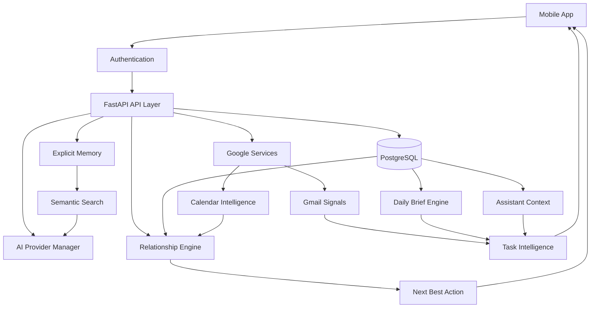

---

## Connected Services

### Google Calendar

Google Calendar support includes OAuth URL generation, token exchange paths, encrypted token storage, sync endpoints, calendar event storage, and mobile connected-service state. Development flows can use mock/simulated connection behavior.

### Gmail

Gmail support includes provider integration records, message storage, sync simulation, Gmail adapter code, email list surfaces, and task-suggestion inputs from email content.

### OAuth

The backend includes Google OAuth routes, state handling, callback/deep-link support, reconnect URLs, and token exchange infrastructure.

### Secure Token Storage

OAuth access and refresh tokens are encrypted at rest using Fernet symmetric encryption when real tokens are stored. Token fields are not returned in API responses.

### Synchronization

Integration sync endpoints support status inspection, provider sync, per-integration sync, disconnect, reconnect, and deterministic simulated sync for development.

### Future Integrations

Microsoft, Apple, GitHub, and Notion are roadmap integrations. They are not represented as completed production integrations in the current codebase.

---

## System Architecture

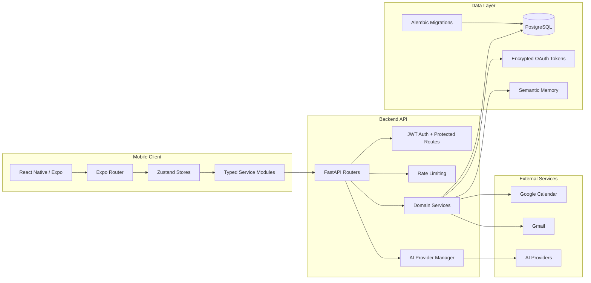

---

## Technology Stack

| Area | Technology |
|---|---|
| Mobile language | TypeScript |
| Mobile framework | React Native 0.83, Expo SDK 55 |
| Navigation | Expo Router, React Navigation |
| Mobile state | Zustand, AsyncStorage persistence |
| Mobile UI | Custom component system, Expo Symbols, React Native SVG, Expo Glass Effect |
| Backend language | Python 3.12.13 |
| Backend framework | FastAPI, Uvicorn |
| Validation/config | Pydantic v2, pydantic-settings |
| Database | PostgreSQL 16, SQLite for selected test runs |
| ORM/migrations | SQLAlchemy 2.0, Alembic |
| Authentication | JWT access/refresh tokens, bcrypt password hashing |
| AI | Provider abstraction, OpenAI package, Anthropic provider module, mock provider for deterministic local/test workflows |
| Semantic memory | Embedding service, semantic memory tables, retrieval endpoints |
| OAuth/token security | Google OAuth routes, cryptography/Fernet encrypted token storage |
| Rate limiting | slowapi |
| Testing | pytest, pytest-asyncio, pytest-cov, Jest, ts-jest |
| Containerization | Dockerfile, Docker Compose |
| Development tooling | Expo CLI, EAS scripts, TypeScript, ESLint |

---

## Repository Structure

```text
.
├── backend/                 FastAPI API, SQLAlchemy models, Alembic migrations, Docker config
├── mobile/                  React Native / Expo application
├── docs/                    Architecture, deployment, release, demo, operations, and roadmap docs
├── assets/                  Shared design and branding assets
├── README.md                Project overview and setup guide
└── .python-version          Python version pin for backend development
```

Key backend directories:

```text
backend/app/ai/              Provider manager, prompts, context services, orchestration
backend/app/models/          SQLAlchemy models for users, goals, tasks, memory, integrations, history, autonomy
backend/app/routers/         API route groups
backend/app/schemas/         Pydantic request/response contracts
backend/app/services/        Domain services for briefs, memory, Google sync, relationships, task engine
backend/alembic/versions/    Database migrations
backend/tests/               Backend pytest suite
```

Key mobile directories:

```text
mobile/src/app/              Expo Router screens and layouts
mobile/src/components/       Feature components and shared UI primitives
mobile/src/services/         API client and resource-specific service modules
mobile/src/store/            Zustand stores
mobile/src/theme/            Theme tokens and theme context
mobile/src/utils/            Formatting, date input, life area, and suggestion-ranking utilities
```

---

## Security

Implemented security measures include:

- JWT access and refresh token authentication
- Protected backend routes using authenticated user dependencies
- bcrypt password hashing
- Password change requiring the current password
- Email change requiring the current password
- User-scoped database queries for protected resources
- OAuth token encryption at rest using Fernet
- No OAuth access or refresh tokens returned in API responses
- Environment-driven secrets and configuration
- `.env` files excluded from source control
- Startup warnings for weak JWT secrets and missing/invalid token encryption keys
- Request IDs and structured request logging
- Rate limiting infrastructure through `slowapi`
- Frontend route guards and session-expiration handling

Security-sensitive values such as JWT secrets, AI provider keys, OAuth client secrets, database URLs, and token encryption keys must be supplied through environment variables or deployment secrets.

---

## API Overview

The backend exposes versioned routes under `/api/v1`.

| API group | Purpose |
|---|---|
| `/auth` | Signup, login, refresh, current user, account operations |
| `/profile` | Profile, User ID, display name, email change, password change |
| `/settings` | User preferences and personalization |
| `/dashboard` | Home/dashboard summary data |
| `/goals` | Goal list, detail, create, update, delete, linked tasks |
| `/tasks` | Task list, create, update, delete |
| `/task-engine` | Suggested tasks, accept/reject, schedule, complete |
| `/calendar/events` | Calendar event CRUD |
| `/calendar/daily-snapshots` | Daily calendar/memory snapshots |
| `/history` | Month timeline, day history, notes, locks, ranges |
| `/relationships` | Next best action, goal progress, available windows |
| `/daily-brief` | Today's brief, generate, date lookup |
| `/ai` | Daily briefing, planning, chat, action execution |
| `/ai/conversations` | Conversation history |
| `/assistant/context` | Assistant context preview |
| `/ai/memory` | Explicit AI memory |
| `/semantic-memory` | Semantic memory and retrieval |
| `/agents` | Agent profiles and orchestration |
| `/integrations` | Integration status, OAuth, sync, reconnect, disconnect |
| `/email` | Email messages and message operations |
| `/notifications` | Notification list, read state, deletion |
| `/autonomy` | Queue, suggestions, daily plan, rules, audit log |
| `/background-jobs` | Background job management and triggering |
| `/health`, `/version` | System status and version metadata |

Swagger documentation is available from a running backend at `http://localhost:8000/docs`.

---

## Getting Started

### Prerequisites

- Python 3.12.13
- Node.js compatible with Expo SDK 55
- Docker and Docker Compose
- npm
- iOS Simulator and Xcode for local iOS development

### Clone

```bash
git clone <repository-url>
cd helios-life-os
```

### Backend

```bash
cd backend
cp .env.example .env
make up
```

Backend services:

- API: `http://localhost:8000`
- Swagger: `http://localhost:8000/docs`
- PostgreSQL: `localhost:5432`

### Mobile

```bash
cd mobile
npm install
npx expo start
```

Press `i` in the Expo terminal to open iOS Simulator.

Mobile API URL resolution:

1. `EXPO_PUBLIC_API_URL` is always used when present, in development and production.
2. iOS Simulator falls back to `http://localhost:8000`.
3. Android Emulator falls back to `http://10.0.2.2:8000`.
4. Physical devices and production builds require `EXPO_PUBLIC_API_URL`.

For physical-device LAN testing, copy `mobile/.env.example` to `mobile/.env` and set your Mac's local IP:

```ini
EXPO_PUBLIC_API_URL=http://192.168.1.110:8000
```

---

## Environment Variables

### Backend

Copy `backend/.env.example` to `backend/.env`.

| Variable | Purpose |
|---|---|
| `APP_NAME` | Application name exposed by the API |
| `API_VERSION` | Version segment for API routes |
| `VERSION` | Backend service version |
| `DEBUG` | Re-raise unhandled exceptions in local development |
| `ENVIRONMENT` | Runtime environment label |
| `LOG_LEVEL` | Optional logging level override |
| `HOST` | Uvicorn host |
| `PORT` | Uvicorn port |
| `DATABASE_URL` | PostgreSQL connection string |
| `JWT_SECRET_KEY` | JWT signing secret; must be strong outside local development |
| `JWT_ALGORITHM` | JWT signing algorithm |
| `JWT_ACCESS_TOKEN_EXPIRE_MINUTES` | Access token lifetime |
| `JWT_REFRESH_TOKEN_EXPIRE_DAYS` | Refresh token lifetime |
| `CORS_ORIGINS` | Comma-separated allowed origins |
| `AI_PROVIDER` | Primary AI provider |
| `AI_PROVIDER_FALLBACK_ORDER` | Provider fallback order |
| `AI_PROVIDER_TIMEOUT_SECONDS` | AI provider timeout |
| `AI_PROVIDER_MAX_RETRIES` | AI provider retry count |
| `OPENAI_API_KEY` | Required for OpenAI-backed generation |
| `OPENAI_MODEL` | OpenAI generation model |
| `OPENAI_EMBEDDING_MODEL` | Embedding model for semantic memory |
| `ANTHROPIC_API_KEY` | Optional secondary provider key |
| `ANTHROPIC_MODEL` | Secondary provider model identifier |
| `GOOGLE_CLIENT_ID` | Google OAuth client ID |
| `GOOGLE_CLIENT_SECRET` | Google OAuth client secret |
| `GOOGLE_REDIRECT_URI` | Backend OAuth callback URI |
| `GOOGLE_OAUTH_APP_REDIRECT_URI` | Mobile deep-link redirect URI |
| `GOOGLE_SCOPES` | Google OAuth scopes |
| `TOKEN_ENCRYPTION_KEY` | Fernet key for encrypting OAuth tokens |

### Mobile

Copy `mobile/.env.example` to `mobile/.env` when a local override is needed.

| Variable | Purpose |
|---|---|
| `EXPO_PUBLIC_API_URL` | API base URL embedded into Expo builds; required for physical devices, staging, and production |

---

## Development

### Backend Commands

```bash
cd backend
make up          # Build and start API + Postgres
make migrate     # Run Alembic migrations in the API container
make test        # Run full backend pytest suite in Docker
make test-local  # Run local pytest using backend/.venv
make logs        # Tail backend API logs
```

Local backend without Docker:

```bash
cd backend
python3.12 -m venv .venv
source .venv/bin/activate
python -m pip install --upgrade pip
python -m pip install -r requirements.txt -r requirements-test.txt
alembic upgrade head
uvicorn app.main:app --reload --host 0.0.0.0 --port 8000
```

Use Python 3.12.13. Python 3.14 is not currently supported by the backend dependency stack.

### Mobile Commands

```bash
cd mobile
npm install
npx expo start
npm run ios
npx tsc --noEmit
npm run lint
npm test
```

### Migrations

```bash
cd backend
alembic upgrade head
```

The production Docker image also runs `alembic upgrade head` before starting Uvicorn.

---

## Testing

### Backend Testing

Recommended reproducible run:

```bash
cd backend
make test
```

Local venv run:

```bash
cd backend
PYTHONPATH=. ./.venv/bin/pytest
```

Targeted example:

```bash
cd backend
PYTHONPATH=. ./.venv/bin/pytest tests/test_profile_display_name.py tests/test_profile_user_id.py
```

### Mobile Testing

```bash
cd mobile
npx tsc --noEmit
npm run lint
npm test
```

### Manual QA

Manual QA should cover:

- Signup, login, refresh, logout, and session expiration
- Home brief and recommendation loading
- Assistant chat, context preview, and AI unavailable states
- Goal creation, details, progress, and linked tasks
- Task creation, completion, scheduling, and suggestions
- Calendar month/day views and event creation
- Connected Services status, sync, disconnect, and reconnect states
- Profile settings, User ID, display name, email change, password change, and theme switching
- Light/dark/system theme behavior
- Network timeout and backend unavailable handling

### Private Beta Testing

See [docs/private-beta-readiness-checklist.md](docs/private-beta-readiness-checklist.md) and [docs/release-checklist.md](docs/release-checklist.md).

---

## Screenshots

Production screenshot assets are not yet committed as a formal gallery. Use [docs/screenshot-guide.md](docs/screenshot-guide.md) for capture workflow.

Planned README screenshot set:

| Screen | Placeholder |
|---|---|
| Home | Daily brief, status, and next best action |
| Assistant | Context-aware assistant conversation |
| Goals | Goal progress and linked tasks |
| Tasks | Task center with HELIOS suggestions |
| Calendar | Monthly timeline and day detail |
| Connected Services | Google Calendar and Gmail status |
| Profile | Account, security, and personalization settings |

---

## Roadmap

### Current Focus

- Private beta QA and bug fixing
- App-wide mobile polish and accessibility improvements
- Backend contract stabilization for mobile intelligence wiring
- Reliable local and Docker-based development workflows
- Production readiness for deployment, monitoring, and release operations

### Next

- Broader automated mobile coverage
- More robust integration sync observability
- Improved AI evaluation and deterministic regression checks
- Expanded onboarding and first-run personalization
- Stronger background job scheduling and alerting
- Production screenshot gallery and beta documentation

### Future Vision

- Microsoft calendar/mail integration
- Apple Calendar and Reminders integration
- GitHub and Notion context connectors
- More advanced proactive planning and safe automation
- Cross-platform release strategy beyond iOS
- Team, household, or shared-goal collaboration models

---

## Portfolio Value

HELIOS demonstrates:

- Full-stack product engineering across mobile, backend, database, and infrastructure
- Production-style API design with protected routes, typed schemas, migrations, and tests
- Mobile architecture using Expo Router, Zustand stores, typed services, and a custom design system
- AI system design with provider abstraction, context retrieval, semantic memory, and task intelligence
- OAuth architecture with secure token storage and integration sync flows
- Security practices including JWT, bcrypt, encrypted tokens, environment-based secrets, and user isolation
- System design across goals, tasks, calendars, memory, history, and recommendations
- Product thinking around daily workflows, private beta readiness, UX polish, and operational reliability

---

## Contributing

Contributions should preserve the architecture already present in the repository:

1. Keep backend behavior user-scoped and covered by tests.
2. Prefer typed service contracts over ad hoc request handling.
3. Run backend migrations for schema changes.
4. Run mobile typecheck and lint before submitting changes.
5. Keep secrets out of source control.
6. Document new environment variables, endpoints, and operational requirements.

Useful references:

- [docs/architecture-overview.md](docs/architecture-overview.md)
- [docs/environment-setup-guide.md](docs/environment-setup-guide.md)
- [docs/operations-runbook.md](docs/operations-runbook.md)
- [docs/deployment.md](docs/deployment.md)

---

## License

No repository license file is currently present. Add a license before distributing or accepting external contributions.
